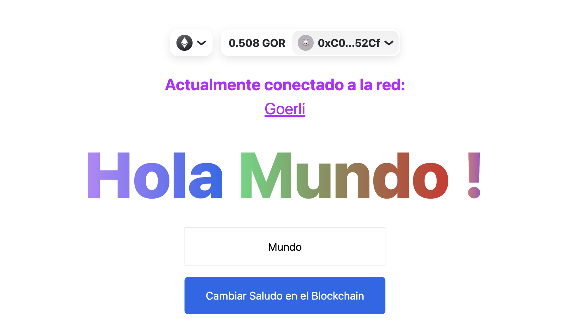
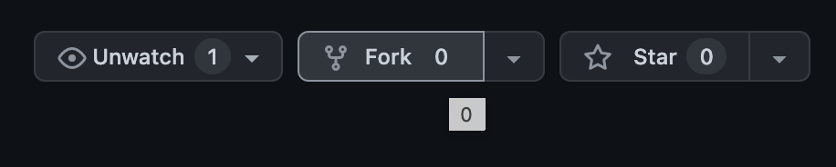

# 👋 Hola Mundo Web3 Starter Kit - (English/Español)!


* A starter project to get you quickly setup for building your DApp on Ethereum and Polygon!
* ¡Un proyecto inicial para configurar rápidamente la creación de su DApp en Ethereum y Polygon!
* Este es un proyecto "multi-chain" compatible con las redes de prueba de goerli y mumbai, que pueden usar para el proximo hackathon. :)


* Stack Used: Typescript, Next.js, Tailwind CSS, Hardhat, Ethers.js, Rainbow Wallet, and WAGMI
* Networks: Goerli & Polygon Mumbai Testnets

# 🏄‍♂️ Quick Start

### Before you clone this project make sure you have the following installed on your machine (in this order)
> Antes de clonar este proyecto, asegúrese de tener instalado lo siguiente en su máquina (en este orden)
* [Node.js](https://nodejs.org/en/)
* [Yarn](https://classic.yarnpkg.com/en/docs/install/)
* [Git](https://git-scm.com/downloads)

### You can check by running these commands on your terminal
> Puedes verificar ejecutando estos comandos en su terminal
```
node -v
yarn -v
git --version
```
### Create a Burner Wallet, Alchemy Account, and Etherscan Account:
> Cree una billetera Burner, una cuenta de Alchemy y una cuenta de Etherscan
* [Metamask](https://metamask.io/) 
   * EN: IMPORTANT: It is recommended you create a burner wallet to be used for development only, avoid using your regular metamask wallet!
   * ESP: IMPORTANTE: se recomienda que cree una billetera de quemador para usar solo para desarrollo, ¡evite usar su billetera metamask normal!
* [Alchemy](https://www.alchemy.com/)
  * EN: After signing up, generate un api key for goerli & mumbai.
  * ESP: Después de registrarse, genere una clave api para goerli & mumbai.
* [Etherscan](https://etherscan.io/apis)
  * After signing up, generate an api key
  * Después de registrarse, genere una clave api

### Fund Your Account(s):
> Financie sus cuentas
* [Georli Faucet](https://goerlifaucet.com/)
* [Polygon Faucet (Mumbai Network)](https://faucet.polygon.technology/)

### Let's Get Building!
> Vamos a construir!
* EN: First, fork this project by clicking the fork button in the upper right hand corner of the repo page.
  * ESP: Primero, 'FORK' este proyecto haciendo clic en el botón de 'FORK' en la esquina superior derecha de la página del repositorio.
  * 
* EN: Second, open your terminal and run the following command with the correct inputs.
  * ESP: En segundo lugar, abra su terminal y ejecute el siguiente comando con las entradas correctas.
  
```bash
git clone https://github.com/<YOUR-USERNAME>/<YOUR-REPOSITORY-NAME>
```

* EN: install all project 👷‍ dependencies by changing directories into hardhart/ and then, next-app/ and running `yarn install`:
  * ESP: instale todas las dependencias del proyecto 👷‍ cambiando los directorios a hardhart/ y luego, next-app/ y ejecutando `yarn install`:
```bash
cd /hardhat
yarn install
```
### Open another terminal window - Abre otra ventana de terminal 
```bash
cd /next-app
yarn install
```

### EN: You will have two terminal windows open, one for your front-end and one for smart-contract development
* Navigate to hardhat/README.md for more information on commands to run for compiling/deploying smart contracts.
* Navigate to next-app/README.md for more information on commands to run for running your front-end
### ESP: Tendrá dos ventanas de terminal abiertas, una para su front-end y otra para el desarrollo de smart-contract
* Vaya a hardhat/README.md para obtener más información sobre los comandos a ejecutar para compilar/desplegar smart contracts.
* Vaya a next-app/README.md para obtener más información sobre los comandos a ejecutar para ejecutar su interfaz (front-end)
  
<br/> 

# 🚧 Logistics

🔏 Edit your smart contract `HolaMundo.sol` in `hardhat/contracts/`

📝 Edit your frontend `index.tsx` in `next-app/pages/`

💼 Edit your deployment scripts `deploy.ts` in `hardhat/scripts/`

# 🚀 Deploy your front-end to Vercel!

<br/>

# 📚 Resources
Solidity: https://docs.soliditylang.org/en/v0.8.15/
<br/>
Next.js: https://nextjs.org/docs
<br/>
Tailwind CSS: https://tailwindcss.com/docs/installation
<br/>
Hardhat: https://hardhat.org/getting-started/
<br/>
Ethers.js: https://docs.ethers.io/v5/
<br/>
Rainbow Kit: https://www.rainbowkit.com/docs/introduction 
<br/>
Wagmi: https://wagmi.sh/docs/getting-started
